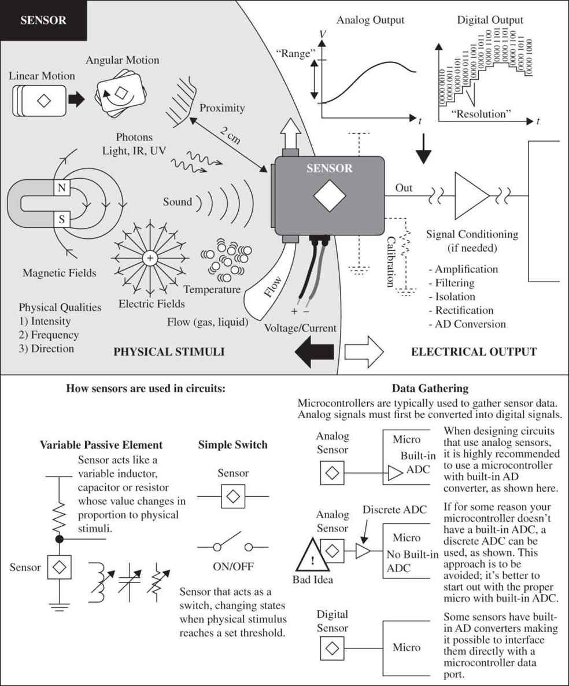
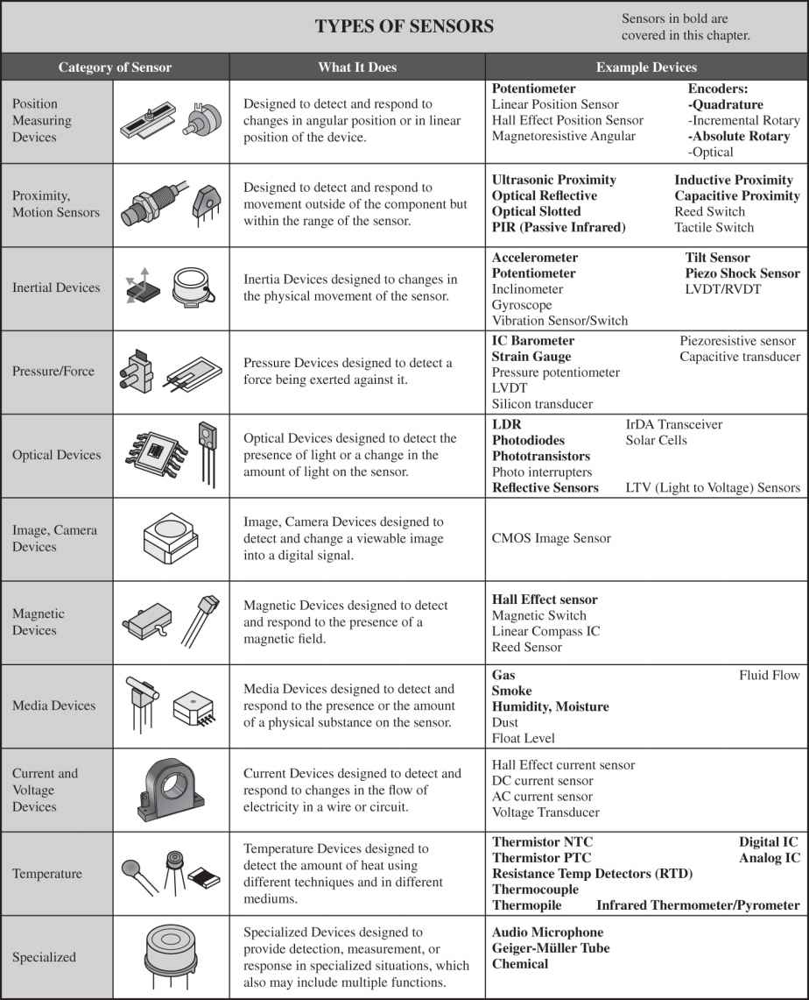
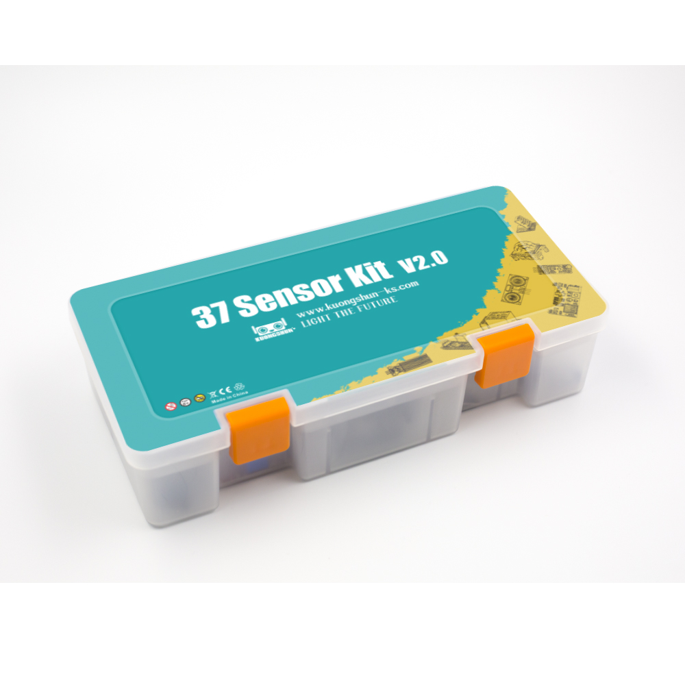
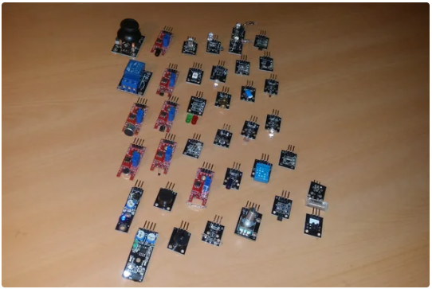

# Ensayos varios
Ensayos con diferentes tipos de sensores

## Sensores y actuadores

### Sensores

Los sensores son dispositivos de hardware que permiten percibir el mundo fisico (medir una o mas propiedades del entorno y enviar la información a un dispositivo IoT). Para esto, los sensore convierten la variable sensada en una señal electrica que puede ser interpretada por un dispositivo IoT. Esta señal depende del sensor, asi como el protocolo de comunicación usado para comunicarse con el dispositivo IoT. La siguiente figura (tomada del libro Practical Electronics for Investors) ilustra lo anteriormente descrito:

  

Existen diferentes tipos de sensores que permiten medis muchas cosas, desde propiedades naturales taltes como la temperatura del aire a interacciones fisicas como el movimiento. Algunos tipos de sensores existentes son:
* **Sensores de temperatura**: Permiten medir la temperatura del aire o el medio en el cual se encuentran inmersos. A veces suelen venir cominados con sensores de humedad y presión en un mismo modulo.
* **Botones**: Permiten sensar cuando estos son presionados.
* **Sensores de luz**: Estos detectan niveles de luz. Tambien permiten medir distintos tipos de luz (de colores especificos, ultravioleta, infraroja o luz visible en general).
* **Acelerometros**: Permiten medir el movimiento en multiples direcciones.
* **Microfonos**: estos permiten detectar sonidos.

La siguiente tabla (tomada del mismo texto), muestra algunos tipos adicionales de sensores:

  

### Tipos de sensores

#### Sensores analógicos

Son el tipo de sensores mas basicos que existen. Estos sensores son alimentados con voltaje (voltaje de alimentación) desde el dispositivo IoT y devolvuelven este para su lectura un voltaje cuya variación depende de la variable medida tal y como lo muestra la siguiente figura (tomada del siguiente [link](https://github.com/microsoft/IoT-For-Beginners/tree/main/1-getting-started/lessons/3-sensors-and-actuators)).

  

Debido a que los dispositivos IoT son digitales, los valores obtenidos al usar sensores analogos deben ser convertidos a una señal digital antes de ser procesados de modo que muchos dispositivos IoT tienen **Conversores analogo a digital (ADCs)** para convertir señales analogas a representaciones digitales de su valor. En caso de que el dispositivo no tenga **ADCs**, estos pueden ser conectados al dispositivo como un modulo exterior (Como el caso de la rPi). 

Cuando un sensor esta conectado a un dispositivo IoT, el valor analogo leido debe ser convertido a una representación digital la cual depende del rango de variación de la señal analoga de entrada y del tipo de dispositivo. El rango de valores de un **ADC** depende del numero de bits de resolución, por ejemplo, si un **ADC** es de 10 bits, el rango de valores estara entre 0-1023.

#### Sensores digitales
 
Los sensores digitales detectan cambios de voltaje que solo pueden tomar dos posibles valores (alto y bajo). El tipo mas simple de sensor de este tipo es un **boton** o **switch**, el cual es un sensor con dos estados **ON** y **OFF** tal y como se muestra en la siguiente figura (tomada del siguiente [link](https://github.com/microsoft/IoT-For-Beginners/tree/main/1-getting-started/lessons/3-sensors-and-actuators))

  

#### Sensores inteligentes

Estos sensores tiene el hardware necesario para poder procesar la señal de modo que pueden ser conectados directamente al dispositivo IoT. Un caso tipico de estos sensores consisten en los sensores de temperatura que vienen integrados con un **ADC** de modo que los valores analogos leidos son convertidos en señales digitales que se envian al dispositivo IoT como datos. Enviar datos en forma digital permite que los sensores sean mas complejos y que envien datos mas detallados, incluso encriptados si la seguridad es importante, un sensor de este tipo lo constituye una camara, la cual captura una imagen y envia los datos de esta al dispositivo IoT empleando un formato digital comprimido como el JPEG. La siguiente figura (tomada del siguiente [link](https://github.com/microsoft/IoT-For-Beginners/tree/main/1-getting-started/lessons/3-sensors-and-actuators)) ilustra esto:

  

### Actuadores

Continuara... [link](https://github.com/microsoft/IoT-For-Beginners/tree/main/1-getting-started/lessons/3-sensors-and-actuators)

### Sensores y actuadores del laboratorio

#### Grove - Starter Kit v3 ([link](https://wiki.seeedstudio.com/Grove_Starter_Kit_v3/))

  

#### 37 sensor kit Elegoo ([link](https://spot.pcc.edu/~dgoldman/labs/37SENSORKIT.pdf))

  

#### Landzo 37 In 1 Sensors Kit For Arduino ([link](https://www.instructables.com/Arduino-37-in-1-Sensors-Kit-Explained/))

  

|Sensor|Grove - Starter Kit v3|37 sensor kit Elegoo|Landzo 37 In 1 Sensors Kit For Arduino|
|---|---|---|---|
|Grove - Sound Sensor|x|||
|Grove - Touch Sensor|x|||
|Grove - Rotary Angle Sensor|x|||
|Grove – Temperature Sensor|x|||
|Grove - Light Sensor|x|||
|DHT11 Temperature and Humidity Module||x||
|DS18B20 Temperature Sensor Module||x||
|Button switch module||x||
|Tilt Switch module||x||
|Photo Interrupter Module||x||
|Light Dependent Resistor Module||x||
|Large Microphone Module||x||
|Small microphone module||x||
|Reed Switch Module||x||
|digital temperature sensor module||x||
|Linear Magnetic Hall Sensor||x||
|Flame Sensor Module||x||
|Touch Sensor||x||
|Joystick Module||x||
|Line Tracking Module||x||
|Obstacle Avoidance Sensor||x||
|Rotary Encode Module||x||
|Ultrasonic Sensor Module||x||
|MPU 6050 Module||x||
|HC SR501 PIR Sensor||x||
|Water Level Detection Sensor Module||x||
|Keypad Module||x||
|KY-023 Joystick module|||x|
|KY-026 Flame Sensor Module|||x|
|KY-016 RGB LED Module|||x|
|KY-016 Heartbeat Sensor module|||x|
|KY-027 2PCS Light Cup module|||x|
|KY-003 Hall Magnetic Sensor|||x|
|KY-024 Linear Hall Sensor|||x|
|KY-017 Mercury Tilt Switch|||x|
|KY-001 18B20 Temperature Sensor|||x|
|KY-037 Big Sound Sensor|||x|
|KY-036 Touch Sensor|||x|
|KY-020 Ball Switch|||x|
|KY-013 Analog Temperature Sensor|||x|
|KY-038 Small Sound Sensor|||x|
|KY-028 Digital Temperature Sensor|||x|
|KY-018 Photoresistor|||x|
|KY-033 Tracking Sensor|||x|
|KY-025 Reed Switch|||x|
|KY-002 Shock Sensor|||x|
|KY-015 Temperature and Humidity Sensor|||x|
|KY-040 Rotary Encoder|||x|
|KY-035 Analog Hall Sensor|||x|
|KY-031 - Tap Module|||x|
|KY-010 - Light blocking|||x|
|KY-021 Mini Reed Switch|||x|
|KY-032 Avoidance Sensor|||x|

### Actuadores

Los actuadores son lo contrario de los sensores. Los actuadores convierten una señal electrica proveniente del dispositivo IoT en una interacción con el mundo fisico tal como la emisión de luz o sonido, o el movimiento de un motor. Algunos actuadores comunes incluyen:
* **Led**: Estos emiten luz cuando son encendidos.
* **Alatavoz**: Este elemento emite sonido basado en la señal que recibe, desde un buzzer basico a un parlante de audio puede ser empleado en la reproducción de musica.
* **Motor paso a paso**: Este convierte una señal en una rotación definida.
* **Relay**: Son swiches que pueden ser encendidos o apagados por medio de una señal electrica. Estos permiten que pequeños voltajes provenientes de dispositivos IoT puedan manejar altos voltajes.
* **Pantallas**: Son uno de los actuadores mas completos y muesntran información en un display multi.segmentos. Los displays pueden variar desde display LED sencillos a monitores de video de alta resolución.

La siguiente figura (tomada de [link](https://microsoft.github.io/IoT-For-Beginners/#/1-getting-started/lessons/3-sensors-and-actuators/README?id=interact-with-the-physical-world-with-sensors-and-actuators)) muestra el uso de un actuador (Led) en un dispositivo IoT controlado por un sensor (fotocelda) para la implementación de un controlador de luz nocturna. En este caso, el dispositivo IoT funciona comparando los niveles de luz entregados por el sensor accionando el led cuando el nivel de luz detectado es demasiado bajo.

  

|Actuador|Grove - Starter Kit v3|37 sensor kit Elegoo|Landzo 37 In 1 Sensors Kit For Arduino|
|---|---|---|---|
|Grove - LCD RGB Backlight|x|||
|Grove – Relay|x|||
|Grove – Buzzer|x|||
|Grove - LED|x|||
|IR Transmitter Module||x||
|IR Receiver Module||x||
|seven Color flash Module||x||
|Passive Buzzer||x||
|Laser Module||x||
|RGB LED Module||x||
|SMD RGB LED Module||x||
|Two Color LED Module (5mm)||x||
|Seven Color flash Module||x||
|Relay Module||x||
|LCD display||x||
|DS1307 Serial Real Time Clock||x||
|KY-019 Relay Module|||x|
|KY-009 SMD RGB LED|||x|
|KY-034 7 Color Flash LED|||x|
|KY-011 Two Color LED|||x|
|KY-008 Laser Emitter|||x|
|KY-029 Mini Two-color LED |||x|
|KY-004 Button|||x|
|KY-005 IR Emitter|||x|
|KY-012 Buzzer|||x|
|KY-022 IR Receiver|||x|
|KY-006 Passive Buzzer|||x|

## Lecturas recomendadas

https://microsoft.github.io/IoT-For-Beginners/#/1-getting-started/lessons/3-sensors-and-actuators/README?id=interact-with-the-physical-world-with-sensors-and-actuators

## Enlaces 

* https://spot.pcc.edu/~dgoldman/#eet101
* https://www.accessengineeringlibrary.com/content/book/9780071771337/chapter/chapter6
* https://learn.sparkfun.com/tutorials/tags/sensors?page=all
* https://www.adafruit.com/category/35
* https://imada.sdu.dk/~marco/Teaching/AY2016-2017/DM841/
* https://github.com/UdeA-IoT/actividad-4