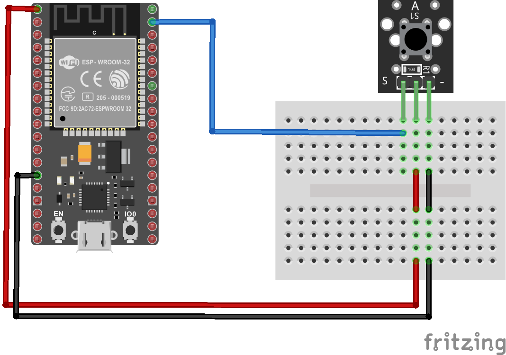
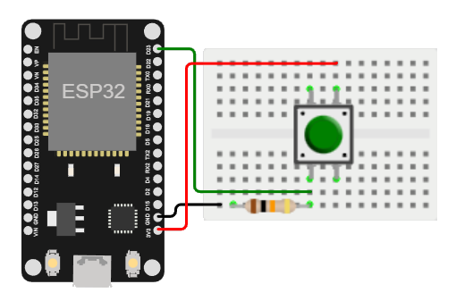

# Uso de un pulsador en el ESP32

## Ejemplo

### Descripción y componentes

En el siguiente ejemplo se emplea un pulsador para prender y apagar el led integrado a la placa ESP32.

La siguiente tabla muestra los componentes principales del circuito a montar:

| Componentes	| Cantidad |Observaciones|
|---|---|---|
|ESP32	|1|Se usará el led integrado (y no uno externo) en la placa como indicador|
|Button switch module (Elegoo) |	1|Tambien se puede emplear cualquiera de los otros módulos disponibles: el KY-004 Button (Landzo) o Grove – Button (seeed)|

### Conexión

La conexión entre el sensor Button switch module (Elegoo) se muestra en la siguiente tabla:

| ESP32	| Button switch module |
|---|---|
|P23 |   S (Signal: pin 1 - izquierda)|
|3.3 |   Vin (Power: pin 2 - centro)|
|GND |   GND (GND: pin 3 - derecha)|

A continuación se muestra la conexión entre los componentes:

<p align="center">
  
</p>

### Programa

A continuación se muestra el programa que se ejecuta en el ESP32:

```ino
/**
   Hardware Connections:

    ESP32 | Button switch module
    -------------------
      P23   |   S (Signal: pin 1 - izquierda)
      3.3   |   Vin (Power: pin 2 - centro)
      GND   |   GND (pin 3 - derecha)
*/

const int led = LED_BUILTIN; // Define the LED pin
const int buttonPin = 23;    // P23 (GPIO23)
int val;                     // Define a numeric variable

void setup() {
	pinMode(led,OUTPUT);
	pinMode(buttonPin,INPUT);
}

void loop() {
	val = digitalRead(buttonPin); // check the state of the button
	if(val==HIGH) { 
		// if button is pressed, turn LED on
		digitalWrite(led,HIGH);
	}
	else {
		// if button is released, turn LED off
		digitalWrite(led,LOW);
	}
}
```

### Test del programa

Para comprender el funcionamiento del programa, puede seguir el siguiente [link](https://wokwi.com/projects/357785036087055361). En este caso como no se disponde del **Button switch module** se hizo una conexión en la protoboard usando los diferentes componentes.

<p align="center">
  
</p>

