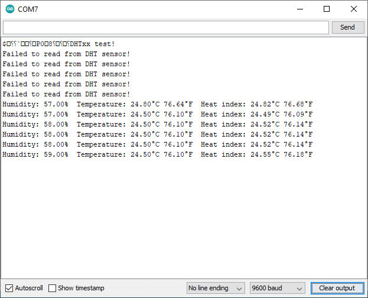
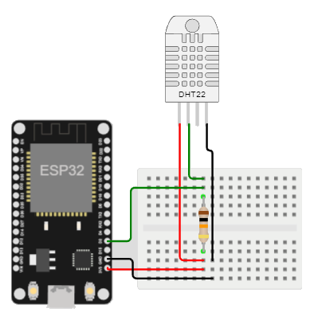

# Implementación del sensor (de temperatura y humedad) DTH11 en el ESP32

## Ejemplo

### Descripción y componentes

En el siguiente muestra en el monitor serial se muestran las variables: humedad, temperatura (en °C y °F) e indice de calor (en °C y °F) medidas usando el sensor de temperatura y humedad (DTH11). Este ejemplo fue adaptado (copiado y modificado) de la pagina **ESP32 with DHT11/DHT22 Temperature and Humidity Sensor using Arduino IDE** ([link]([link](https://randomnerdtutorials.com/esp32-dht11-dht22-temperature-humidity-sensor-arduino-ide/))) de [Random Nerd Tutorials](https://randomnerdtutorials.com/)

La siguiente tabla muestra los componentes principales del circuito a montar:

| Componentes	| Cantidad |
|---|---|
|ESP32	|1|
|DYH11 (sensor de temperatura y humedad) |	1|

### Conexión

La conexión entre el sensor DTH11 se muestra en la siguiente tabla:

| ESP32	| DTH11 |
|---|---|
|3.3V  |   S (pin 1 - izquierda)
|2     |   Vin (pin 2 - centro)
|GND   |   GND (pin 3 - derecha)

A continuación se muestra la conexión entre los componentes:

<p align="center">
  
</p>

### Programa

A continuación se muestra el programa que se ejecuta en el ESP32, el cual basicamente es el mismo programa implementado para el Arduino UNO pero empleando otros pines:

```ino
/**
   Hardware Connections:

    ESP32 | DHT11
    -------------------
      3.3V  |   S (pin 1 - izquierda)
      2     |   Vin (pin 2 - centro)
      GND   |   GND (pin 3 - derecha)
*/

#include "DHT.h"

// Pines
#define DHTPIN 2 

#define DHTTYPE DHT11   // DHT 11
//#define DHTTYPE DHT22   // DHT 22  (AM2302), AM2321
//#define DHTTYPE DHT21   // DHT 21 (AM2301)

DHT dht(DHTPIN, DHTTYPE);

void setup() {
  Serial.begin(9600);
  Serial.println(F("DHTxx test!"));

  dht.begin();
}

void loop() {
  // Wait a few seconds between measurements.
  delay(2000);

  // Reading temperature or humidity takes about 250 milliseconds!
  // Sensor readings may also be up to 2 seconds 'old' (its a very slow sensor)
  float h = dht.readHumidity();
  // Read temperature as Celsius (the default)
  float t = dht.readTemperature();
  // Read temperature as Fahrenheit (isFahrenheit = true)
  float f = dht.readTemperature(true);

  // Check if any reads failed and exit early (to try again).
  if (isnan(h) || isnan(t) || isnan(f)) {
    Serial.println(F("Failed to read from DHT sensor!"));
    return;
  }

  // Compute heat index in Fahrenheit (the default)
  float hif = dht.computeHeatIndex(f, h);
  // Compute heat index in Celsius (isFahreheit = false)
  float hic = dht.computeHeatIndex(t, h, false);

  Serial.print(F("Humidity: "));
  Serial.print(h);
  Serial.print(F("%  Temperature: "));
  Serial.print(t);
  Serial.print(F("°C "));
  Serial.print(f);
  Serial.print(F("°F  Heat index: "));
  Serial.print(hic);
  Serial.print(F("°C "));
  Serial.print(hif);
  Serial.println(F("°F"));
}
```

### Test del programa

La siguiente figura muestra la salida en el monitor serial cuando el programa es ejecutado:

<p align="center">
  
</p>

Para comprender el funcionamiento del programa, puede seguir el siguiente [link](https://wokwi.com/projects/357776308749643777). Tenga en cuenta que en la simulación el sensor empleado es el DTH22 (y no el DTH11) por lo que tanto el código como la conexión del simulador se adapto para este sensor. A continuación se muestra la figura asociada a la simulación:

<p align="center">
  
</p>

