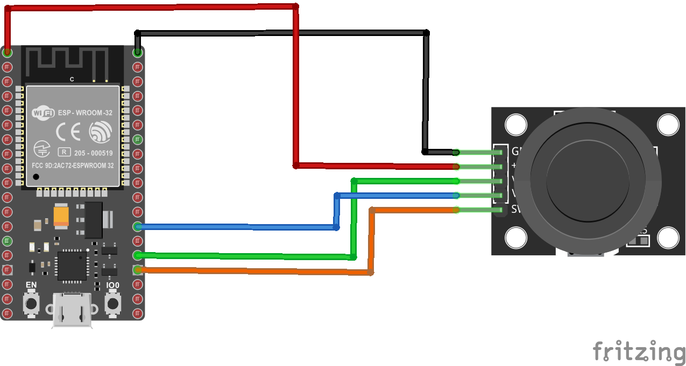
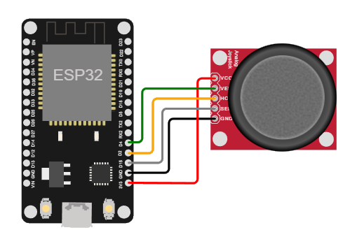

# Uso de un joystic en el ESP32

## Ejemplo

### Descripción y componentes

En el siguiente ejemplo se conecta un joystick para prender a la placa ESP32. El firmware descargado en la placa imprime en el monitor serial las coordenadas x, y y z (valor digital que indica si el joystic fue presionado o no).

La siguiente tabla muestra los componentes principales del circuito a montar:

| Componentes	| Cantidad |Observaciones|
|---|---|---|
|ESP32|1||
|Joystick Module (Elegoo)|1|Tambien se puede emplear el KY-023 Joystick module (Landzo) el cual se encuentra disponible en el laboratorio|

### Conexión

La conexión entre el joystick se muestra en la siguiente tabla:

| ESP32	| DTH11 |
|---|---|
|GND   |   GND (pin 1 - izquierda) |
|3.3   |   +5 (pin 2) |
|P2    |   VRx (pin 3) |
|P4    |   VRy (pin 4) |
|P15   |   SW (pin 5 - derecha) |

A continuación se muestra la conexión entre los componentes:

<p align="center">
  
</p>

### Programa

A continuación se muestra el programa que se ejecuta en el ESP32, el cual basicamente es el mismo programa implementado para el Arduino UNO pero empleando otros pines:

```ino
/**
   Hardware Connections:

    | ESP32	| DTH11 |
    |---|---|
    |GND   |   GND (pin 1 - izquierda) |
    |3.3   |   +5 (pin 2) |
    |P2    |   VRx (pin 3) |
    |P4    |   VRy (pin 4) |
    |P15   |   SW (pin 5 - derecha) |
*/

const int pinX = 2;    //  P2 (GPIO02 - ADC11)
const int pinY = 4;    //  P4 (GPIO04 - ADC12)
const int pinSW = 15;  //  P15 (GPIO15)
int valueX = 0;        //  Analog
int valueY = 0;        //  Analog
int valueZ = 0;        //  Digital

void setup() {
  Serial.begin(9600);
}

void loop() {
  valueX = analogRead(pinX); 
  Serial.print("X:");
  Serial.print(valueX, DEC); 
  valueY = analogRead(pinY); 
  Serial.print(" | Y:"); 
  Serial.print(valueY, DEC); 
  valueZ = digitalRead(pinSW);
  Serial.print(" | Z: "); 
  Serial.println(valueZ, DEC); 
  delay(100);
}
```

### Test del programa

Para comprender el funcionamiento del programa, puede seguir el siguiente [link](https://wokwi.com/projects/357780574847798273) donde hay una simulación del programa.

<p align="center">
  
</p>
