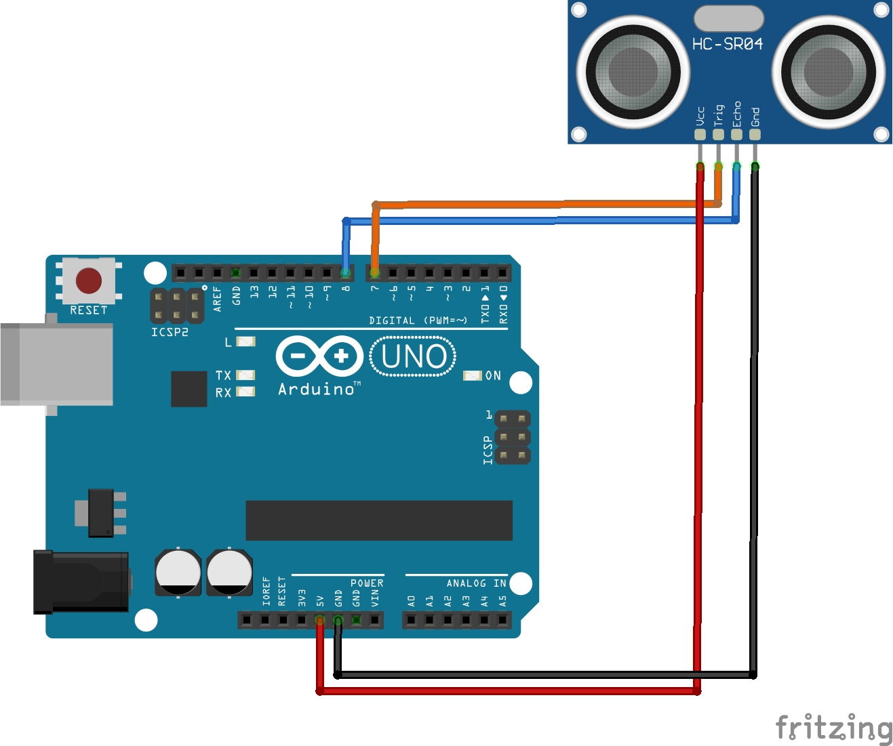
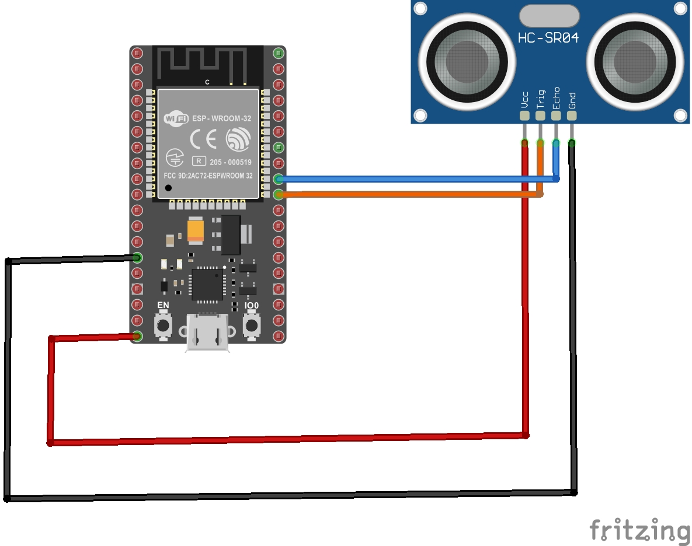

# Sensor de ultrasonido

## Información sobre el sensor


## Implementación en arduino

En este caso se implementan tres ejemplos tomados de [SparkFun Inventor's Kit Experiment Guide - v4.0](https://learn.sparkfun.com/tutorials/sparkfun-inventors-kit-experiment-guide---v40/introduction). Para acceder a estos siga el siguiente [link](arduino/README.md)

...

### Componentes

...

### Programa

Tomado y adaptado de ...

```ino

```

### Conexión

<p align="center">
  
</p>

### Test del programa

Colocar el link de simulación...

## Implementación en el ESP32

...

### Componentes

...

### Programa

```ino

```

### Conexión

<p align="center">
  
</p>

### Test del programa

Colocar el link de simulación...

## Referencias
1. https://learn.sparkfun.com/tutorials/sparkfun-inventors-kit-experiment-guide---v40/circuit-3b-distance-sensor
2. https://github.com/sparkfun/HC-SR04_UltrasonicSensor
3. https://www.sparkfun.com/products/15569
4. https://www.handsontec.com/dataspecs/HC-SR04-Ultrasonic.pdf
5. https://randomnerdtutorials.com/esp32-hc-sr04-ultrasonic-arduino/
6. https://randomnerdtutorials.com/complete-guide-for-ultrasonic-sensor-hc-sr04/
7. https://randomnerdtutorials.com/esp8266-nodemcu-hc-sr04-ultrasonic-arduino/