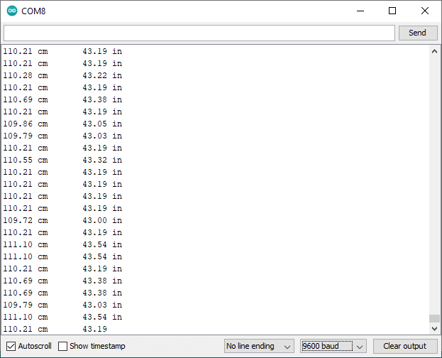

# Implementación del sensor de ultrasonido en arduino

**Usos**

Distance sensors are amazing tools with all kinds of uses. They can sense the presence of an object, they can be used in experiments to calculate speed and acceleration, and they can be used in robotics to avoid obstacles. This circuit will walk you through the basics of using an ultrasonic distance sensor, which measures distance using sound waves!


## Ejemplo 1

### Descripción y componentes

En el siguiente ejemplo muestra, usando el monitor serial, la distancia en centimetros y pulgadas.

Este ejemplo fue adaptado (copiado y modificado) de  **SparkFun Inventor's Kit Experiment Guide - Project 3: Motion** ([link](https://learn.sparkfun.com/tutorials/sparkfun-inventors-kit-experiment-guide---v40/project-3-motion)) y montado en el arduino UNO.

La siguiente tabla muestra los componentes principales del circuito a montar:

<p align="center">

|Componentes|Cantidad|
|---|---|
|Arduino UNO|1|
|Sensor de ultrasonido HC-SR04|1|

</p>

### Conexión

La conexión entre el sensor de ultrasonido se muestra en la siguiente tabla:

<p align="center">

|Arduino|HC-SR04|
|---|---|
|5V|VCC|
|7|Trig|
|8|Echo|
|GND|GND|

</p>

La siguiente figura muestra la conexión entre los componentes:

<p align="center">
  
</p>


### Programa

A continuación se muestra el programa que se ejecuta en el Arduino:

```ino
/**
   Hardware Connections:
    Arduino | HC-SR04
    -------------------
      5V    |   VCC
      7     |   Trig
      8     |   Echo
      GND   |   GND
*/

// Pins
const int TRIG_PIN = 7;
const int ECHO_PIN = 8;

// Anything over 400 cm (23200 us pulse) is "out of range"
const unsigned int MAX_DIST = 23200;

void setup() {

  // The Trigger pin will tell the sensor to range find
  pinMode(TRIG_PIN, OUTPUT);
  digitalWrite(TRIG_PIN, LOW);

  //Set Echo pin as input to measure the duration of 
  //pulses coming back from the distance sensor
  pinMode(ECHO_PIN, INPUT);

  // We'll use the serial monitor to view the sensor output
  Serial.begin(9600);
}

void loop() {

  unsigned long t1;
  unsigned long t2;
  unsigned long pulse_width;
  float cm;
  float inches;

  // Hold the trigger pin high for at least 10 us
  digitalWrite(TRIG_PIN, HIGH);
  delayMicroseconds(10);
  digitalWrite(TRIG_PIN, LOW);

  // Wait for pulse on echo pin
  while ( digitalRead(ECHO_PIN) == 0 );

  // Measure how long the echo pin was held high (pulse width)
  // Note: the micros() counter will overflow after ~70 min
  t1 = micros();
  while ( digitalRead(ECHO_PIN) == 1);
  t2 = micros();
  pulse_width = t2 - t1;

  // Calculate distance in centimeters and inches. The constants
  // are found in the datasheet, and calculated from the assumed speed
  //of sound in air at sea level (~340 m/s).
  cm = pulse_width / 58.0;
  inches = pulse_width / 148.0;

  // Print out results
  if ( pulse_width > MAX_DIST ) {
    Serial.println("Out of range");
  } else {
    Serial.print(cm);
    Serial.print(" cm \t");
    Serial.print(inches);
    Serial.println(" in");
  }

  // Wait at least 60ms before next measurement
  delay(60);
}
```

### Test del programa

La siguiente figura muestra la salida en el monitor serial cuando el programa es ejecutado:

<p align="center">
  
</p>

Empleando el siguiente [link](https://www.tinkercad.com/embed/ezldBrgTwI1?editbtn=1) puede simular el ejemplo para entenderlo antes de montarlo.

## Ejemplo 2

### Descripción y componentes

En este ejemplo adaptado de **SparkFun Inventor's Kit Experiment Guide - Project 3: Motion** ([link](https://learn.sparkfun.com/tutorials/sparkfun-inventors-kit-experiment-guide---v40/project-3-motion)) se controla el control de un Led RGB de acuerdo a la distancia medida por un sensor de ultrasonido.

La siguiente tabla muestra los componentes principales del circuito a montar:

<p align="center">

|Componentes|Cantidad|
|---|---|
|Arduino UNO|1|
|Sensor de ultrasonido HC-SR04|1|
|Led RGB|1|

### Conexión

La conexión entre los componentes de hardware se describe en las siguientes tablas:

* Conexión entre el sensor de ultrasonido y el arduino UNO:
  
<p align="center">

|Arduino|HC-SR04|
|---|---|
|5V|VCC|
|11|Trig|
|12|Echo|
|GND|GND|

</p>

* Conexión entre el led RGB y el arduino UNO:

<p align="center">

|Arduino|Led RGB|
|---|---|
|3|R|
|5|G|
|6|B|
|GND|-|

</p>

La siguiente figura muestra la conexión entre los modulos de hardware y el arduino:

<p align="center">
  
</p>

### Programa

El programa que se ejecuta en el arduino se muestra a continuación, observe el uso de funciones para facilitar la modularización del código:

```ino
/*
  Hardware Connections:
    Arduino | HC-SR04
    -------------------
      5V    |   VCC
      11    |   Trig
      12    |   Echo
      GND   |   GND

    Arduino | RGB led
    -------------------
      3    |   R
      5    |   G
      6    |   B
      GND  |   -
*/

const int trigPin = 11;           //connects to the trigger pin on the distance sensor
const int echoPin = 12;           //connects to the echo pin on the distance sensor

const int redPin = 3;             //pin to control the red LED inside the RGB LED
const int greenPin = 5;           //pin to control the green LED inside the RGB LED
const int bluePin = 6;            //pin to control the blue LED inside the RGB LED

float distance = 0;               //stores the distance measured by the distance sensor

void setup() {
  pinMode(trigPin, OUTPUT);   //the trigger pin will output pulses of electricity
  pinMode(echoPin, INPUT);    //the echo pin will measure the duration of pulses coming back from the distance sensor

  //set the RGB LED pins to output
  pinMode(redPin, OUTPUT);
  pinMode(greenPin, OUTPUT);
  pinMode(bluePin, OUTPUT);
}

void loop() {
  distance = getDistance();   //variable to store the distance measured by the sensor

  Serial.print(distance);     //print the distance that was measured
  Serial.println(" in");      //print units after the distance

  if (distance <= 10) {                       //if the object is close

    //make the RGB LED red
    analogWrite(redPin, 255);
    analogWrite(greenPin, 0);
    analogWrite(bluePin, 0);

  } else if (10 < distance && distance < 20) { //if the object is a medium distance

    //make the RGB LED yellow
    analogWrite(redPin, 255);
    analogWrite(greenPin, 50);
    analogWrite(bluePin, 0);

  } else {                                    //if the object is far away

    //make the RGB LED green
    analogWrite(redPin, 0);
    analogWrite(greenPin, 255);
    analogWrite(bluePin, 0);
  }

  delay(50);      //delay 50ms between each reading
}

//------------------FUNCTIONS-------------------------------

//RETURNS THE DISTANCE MEASURED BY THE HC-SR04 DISTANCE SENSOR
float getDistance() {
  float echoTime;                   //variable to store the time it takes for a ping to bounce off an object
  float calculatedDistance;         //variable to store the distance calculated from the echo time

  //send out an ultrasonic pulse that's 10ms long
  digitalWrite(trigPin, HIGH);
  delayMicroseconds(10);
  digitalWrite(trigPin, LOW);

  echoTime = pulseIn(echoPin, HIGH);      //use the pulsein command to see how long it takes for the
                                          //pulse to bounce back to the sensor

  calculatedDistance = echoTime / 148.0;  //calculate the distance of the object that reflected the pulse (half the bounce time multiplied by the speed of sound)

  return calculatedDistance;              //send back the distance that was calculated
}
```

### Ejecución y prueba

Para comprender ver el programa anterior en acción puede usar el siguiente [link](https://www.tinkercad.com/embed/bZb8yAtFsW0?editbtn=1) para simular el funcionamiento del circuito.

## Ejemplo 3

### Descripción y componentes

En este ejemplo se utiliza un sensor de ultrasonido para detectar la presencia de un objeto que se acerca. De acuerdo a la a la distancia del objeto; el color, el buzzer y el servomotor reaccionaran de la siguiente manera:
* Si el objeto esta muy cerca, el led cambiara a rojo, el buzzer sonara y el motor vibrara.
* Si la distancia es intermedia, el color del led será amarillo.
* Si la distancia es larga, el color del led será verde.

Este ejemplo fue tomado de: **SparkFun Inventor's Kit Experiment Guide - Project 3: Motion Alarm** ([link](https://learn.sparkfun.com/tutorials/sparkfun-inventors-kit-experiment-guide---v40/circuit-3c-motion-alarm)) y montado en el arduino UNO. La siguiente es la lista de componentes empleados:

<p align="center">

|Componentes|Cantidad|
|---|---|
|Arduino UNO|1|
|Sensor de ultrasonido HC-SR04|1|
|Led RGB|1|
|Buzzer|1|
|Servo motor|1|

</p>

### Conexión

La conexión entre los componentes de hardware con el arduino se describe en las siguientes tablas:

* Conexión entre el sensor de ultrasonido y el arduino UNO:
  
<p align="center">

|Arduino|HC-SR04|
|---|---|
|5V|VCC|
|11|Trig|
|12|Echo|
|GND|GND|

</p>

* Conexión entre el led RGB y el arduino UNO:

<p align="center">

|Arduino|Led RGB|
|---|---|
|3|R|
|5|G|
|6|B|
|GND|-|

</p>

* Conexión entre el buzzer y el arduino UNO:

<p align="center">

|Arduino|Buzzer|
|---|---|
|10|S|
|GND|-|

</p>

El pin de la mitad del buzzer no se usa.

* Conexión entre el buzzer y el arduino UNO:

<p align="center">

|Arduino|Servo Motor|
|---|---|
| 9 |   Control (Amarillo) |
| 5V  |   VCC (Rojo) |
| GND |   GND (Negro) |

</p>

La siguiente figura muestra la conexión entre los diferentes componentes de acuerdo a las tablas anteriores:

<p align="center">
  
</p>

### Programa

```ino
/*
    Hardware Connections:

    Arduino | HC-SR04
    -------------------
      5V    |   VCC
      11    |   Trig
      12    |   Echo
      GND   |   GND

    Arduino | RGB led
    -------------------
      3     |   R
      5     |   G
      6     |   B
      GND   |   -

    Arduino | Buzzer
    -------------------
      10    |   S
      GND   |   -
  
    Arduino | Servo motor
    -------------------
      9     |   Control (Amarillo)
      5V    |   VCC (Rojo)
      GND   |   GND (Negro)  
*/

#include <Servo.h>                //include the servo library

const int trigPin = 11;           //connects to the trigger pin on the distance sensor
const int echoPin = 12;           //connects to the echo pin on the distance sensor

const int redPin = 3;             //pin to control the red LED inside the RGB LED
const int greenPin = 5;           //pin to control the green LED inside the RGB LED
const int bluePin = 6;            //pin to control the blue LED inside the RGB LED

const int buzzerPin = 10;         //pin that will drive the buzzer

float distance = 0;               //stores the distance measured by the distance sensor

Servo myservo;                    //create a servo object

void setup()
{
  Serial.begin (9600);        //set up a serial connection with the computer

  pinMode(trigPin, OUTPUT);   //the trigger pin will output pulses of electricity
  pinMode(echoPin, INPUT);    //the echo pin will measure the duration of pulses coming back from the distance sensor

  //set the RGB LED pins to output
  pinMode(redPin, OUTPUT);
  pinMode(greenPin, OUTPUT);
  pinMode(bluePin, OUTPUT);

  pinMode(buzzerPin, OUTPUT);   //set the buzzer pin to output

  myservo.attach(9);            //use pin 9 to control the servo

}

void loop() {
  distance = getDistance();   //variable to store the distance measured by the sensor

  Serial.print(distance);     //print the distance that was measured
  Serial.println(" in");      //print units after the distance

  if (distance <= 10) {                       //if the object is close

    //make the RGB LED red
    analogWrite(redPin, 255);
    analogWrite(greenPin, 0);
    analogWrite(bluePin, 0);

    //this code wiggles the servo and beeps the buzzer
    tone(buzzerPin, 272);         //buzz the buzzer pin
    myservo.write(10);            //move the servo to 45 degrees
    delay(100);                   //wait 100 milliseconds

    noTone(buzzerPin);            //turn the buzzer off
    myservo.write(150);           //move the servo to 135 degrees
    delay(100);                   //wait 100 milliseconds


  } else if (10 < distance && distance < 20) { //if the object is a medium distance

    //make the RGB LED yellow
    analogWrite(redPin, 255);
    analogWrite(greenPin, 50);
    analogWrite(bluePin, 0);

  } else {                                    //if the object is far away

    //make the RGB LED green
    analogWrite(redPin, 0);
    analogWrite(greenPin, 255);
    analogWrite(bluePin, 0);
  }

  delay(50);      //delay 50ms between each reading
}

//------------------FUNCTIONS-------------------------------

//RETURNS THE DISTANCE MEASURED BY THE HC-SR04 DISTANCE SENSOR
float getDistance()
{
  float echoTime;                   //variable to store the time it takes for a ping to bounce off an object
  float calculatedDistance;         //variable to store the distance calculated from the echo time

  //send out an ultrasonic pulse that's 10ms long
  digitalWrite(trigPin, HIGH);
  delayMicroseconds(10);
  digitalWrite(trigPin, LOW);

  echoTime = pulseIn(echoPin, HIGH);      //use the pulsein command to see how long it takes for the
                                          //pulse to bounce back to the sensor

  calculatedDistance = echoTime / 148.0;  //calculate the distance of the object that reflected the pulse (half the bounce time multiplied by the speed of sound)

  return calculatedDistance;              //send back the distance that was calculated
}
```

## Ejecución y prueba

Para comprender ver el programa anterior realice la simulación de este siguiendo el siguiente [link](https://www.tinkercad.com/embed/328sYYW4WTl?editbtn=1).


## Enlaces

1. https://randomnerdtutorials.com/complete-guide-for-ultrasonic-sensor-hc-sr04/
2. https://learn.adafruit.com/ultrasonic-sonar-distance-sensors
3. https://ubidots.com/blog/build-a-tank-volume-reader-in-under-30/
4. https://learn.sparkfun.com/tutorials/sparkfun-inventors-kit-experiment-guide---v40/circuit-3b-distance-sensor
5. https://github.com/sparkfun/HC-SR04_UltrasonicSensor
6. https://www.seeedstudio.com/Grove-Ultrasonic-Distance-Sensor.html
7. https://www.seeedstudio.com/blog/2019/12/23/distance-sensors-types-and-selection-guide/
8. https://www.hackster.io/490770/smart-mobility-stick-fd06fa