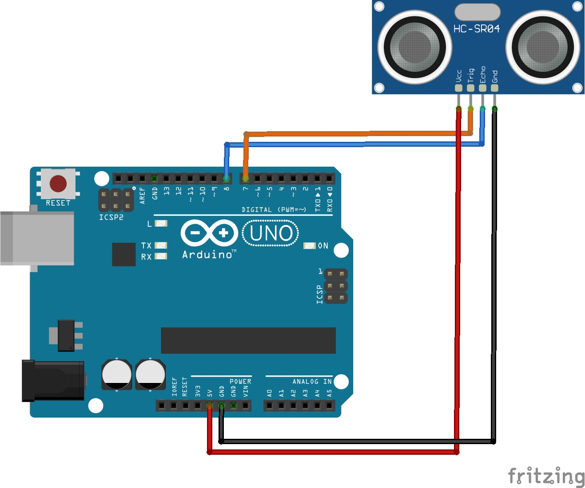

# Implementación del sensor de ultrasonido en arduino


## Ejemplo 1

En construcción...

### Componentes

En construcción...

### Descripción

En construcción...

### Programa

Este ejemplo fue tomado de: **SparkFun Inventor's Kit Experiment Guide - Project 3: Motion** ([link](https://learn.sparkfun.com/tutorials/sparkfun-inventors-kit-experiment-guide---v40/project-3-motion)) y montado en el arduino 1

```ino
/**
   Hardware Connections:
    Arduino | HC-SR04
    -------------------
      5V    |   VCC
      7     |   Trig
      8     |   Echo
      GND   |   GND
*/

// Pins
const int TRIG_PIN = 7;
const int ECHO_PIN = 8;

// Anything over 400 cm (23200 us pulse) is "out of range"
const unsigned int MAX_DIST = 23200;

void setup() {

  // The Trigger pin will tell the sensor to range find
  pinMode(TRIG_PIN, OUTPUT);
  digitalWrite(TRIG_PIN, LOW);

  //Set Echo pin as input to measure the duration of 
  //pulses coming back from the distance sensor
  pinMode(ECHO_PIN, INPUT);

  // We'll use the serial monitor to view the sensor output
  Serial.begin(9600);
}

void loop() {

  unsigned long t1;
  unsigned long t2;
  unsigned long pulse_width;
  float cm;
  float inches;

  // Hold the trigger pin high for at least 10 us
  digitalWrite(TRIG_PIN, HIGH);
  delayMicroseconds(10);
  digitalWrite(TRIG_PIN, LOW);

  // Wait for pulse on echo pin
  while ( digitalRead(ECHO_PIN) == 0 );

  // Measure how long the echo pin was held high (pulse width)
  // Note: the micros() counter will overflow after ~70 min
  t1 = micros();
  while ( digitalRead(ECHO_PIN) == 1);
  t2 = micros();
  pulse_width = t2 - t1;

  // Calculate distance in centimeters and inches. The constants
  // are found in the datasheet, and calculated from the assumed speed
  //of sound in air at sea level (~340 m/s).
  cm = pulse_width / 58.0;
  inches = pulse_width / 148.0;

  // Print out results
  if ( pulse_width > MAX_DIST ) {
    Serial.println("Out of range");
  } else {
    Serial.print(cm);
    Serial.print(" cm \t");
    Serial.print(inches);
    Serial.println(" in");
  }

  // Wait at least 60ms before next measurement
  delay(60);
}
```

### Conexión

<p align="center">
  
</p>

### Test del programa

## Ejemplo 2

En construcción...

### Componentes

En construcción...

### Descripción

En construcción...

### Programa

Toma como base solo la parte de led del ejemplo, (Hacer enfasis en el uso de funciones para facilitar la condificación del programa del arduino)...

```ino
/*
  SparkFun Inventor’s Kit
  Circuit 3B-Distance Sensor

  Control the color of an RGB LED using an ultrasonic distance sensor.

  This sketch was written by SparkFun Electronics, with lots of help from the Arduino community.
  This code is completely free for any use.

  View circuit diagram and instructions at: https://learn.sparkfun.com/tutorials/sparkfun-inventors-kit-experiment-guide---v40
  Download drawings and code at: https://github.com/sparkfun/SIK-Guide-Code
*/

const int trigPin = 11;           //connects to the trigger pin on the distance sensor
const int echoPin = 12;           //connects to the echo pin on the distance sensor

const int redPin = 3;             //pin to control the red LED inside the RGB LED
const int greenPin = 5;           //pin to control the green LED inside the RGB LED
const int bluePin = 6;            //pin to control the blue LED inside the RGB LED

float distance = 0;               //stores the distance measured by the distance sensor

void setup()
{
  Serial.begin (9600);        //set up a serial connection with the computer

  pinMode(trigPin, OUTPUT);   //the trigger pin will output pulses of electricity
  pinMode(echoPin, INPUT);    //the echo pin will measure the duration of pulses coming back from the distance sensor

  //set the RGB LED pins to output
  pinMode(redPin, OUTPUT);
  pinMode(greenPin, OUTPUT);
  pinMode(bluePin, OUTPUT);
}

void loop() {
  distance = getDistance();   //variable to store the distance measured by the sensor

  Serial.print(distance);     //print the distance that was measured
  Serial.println(" in");      //print units after the distance

  if (distance <= 10) {                       //if the object is close

    //make the RGB LED red
    analogWrite(redPin, 255);
    analogWrite(greenPin, 0);
    analogWrite(bluePin, 0);

  } else if (10 < distance && distance < 20) { //if the object is a medium distance

    //make the RGB LED yellow
    analogWrite(redPin, 255);
    analogWrite(greenPin, 50);
    analogWrite(bluePin, 0);

  } else {                                    //if the object is far away

    //make the RGB LED green
    analogWrite(redPin, 0);
    analogWrite(greenPin, 255);
    analogWrite(bluePin, 0);
  }

  delay(50);      //delay 50ms between each reading
}

//------------------FUNCTIONS-------------------------------

//RETURNS THE DISTANCE MEASURED BY THE HC-SR04 DISTANCE SENSOR
float getDistance()
{
  float echoTime;                   //variable to store the time it takes for a ping to bounce off an object
  float calculatedDistance;         //variable to store the distance calculated from the echo time

  //send out an ultrasonic pulse that's 10ms long
  digitalWrite(trigPin, HIGH);
  delayMicroseconds(10);
  digitalWrite(trigPin, LOW);

  echoTime = pulseIn(echoPin, HIGH);      //use the pulsein command to see how long it takes for the
                                          //pulse to bounce back to the sensor

  calculatedDistance = echoTime / 148.0;  //calculate the distance of the object that reflected the pulse (half the bounce time multiplied by the speed of sound)

  return calculatedDistance;              //send back the distance that was calculated
}
```

### Conexión

<p align="center">
  
</p>

## Ejemplo 3

En construcción...

### Componentes

En construcción...

### Descripción

Este ejemplo fue tomado de: **SparkFun Inventor's Kit Experiment Guide - Project 3: Motion Alarm** ([link](https://learn.sparkfun.com/tutorials/sparkfun-inventors-kit-experiment-guide---v40/circuit-3c-motion-alarm)) y montado en el arduino 1


### Programa

Toma como base solo la parte de led del ejemplo, (Hacer enfasis en el uso de funciones para facilitar la condificación del programa del arduino)...

```ino
/*
  SparkFun Inventor’s Kit
  Circuit 3C-Motion Alarm

  Control the color of an RGB LED using an ultrasonic distance sensor. When an object is close to the sensor, buzz the buzzer and wiggle the servo motor.

  This sketch was written by SparkFun Electronics, with lots of help from the Arduino community.
  This code is completely free for any use.

  View circuit diagram and instructions at: https://learn.sparkfun.com/tutorials/sparkfun-inventors-kit-experiment-guide---v40
  Download drawings and code at: https://github.com/sparkfun/SIK-Guide-Code
*/

#include <Servo.h>                //include the servo library

const int trigPin = 11;           //connects to the trigger pin on the distance sensor
const int echoPin = 12;           //connects to the echo pin on the distance sensor

const int redPin = 3;             //pin to control the red LED inside the RGB LED
const int greenPin = 5;           //pin to control the green LED inside the RGB LED
const int bluePin = 6;            //pin to control the blue LED inside the RGB LED

const int buzzerPin = 10;         //pin that will drive the buzzer

float distance = 0;               //stores the distance measured by the distance sensor

Servo myservo;                    //create a servo object

void setup()
{
  Serial.begin (9600);        //set up a serial connection with the computer

  pinMode(trigPin, OUTPUT);   //the trigger pin will output pulses of electricity
  pinMode(echoPin, INPUT);    //the echo pin will measure the duration of pulses coming back from the distance sensor

  //set the RGB LED pins to output
  pinMode(redPin, OUTPUT);
  pinMode(greenPin, OUTPUT);
  pinMode(bluePin, OUTPUT);

  pinMode(buzzerPin, OUTPUT);   //set the buzzer pin to output

  myservo.attach(9);            //use pin 9 to control the servo

}

void loop() {
  distance = getDistance();   //variable to store the distance measured by the sensor

  Serial.print(distance);     //print the distance that was measured
  Serial.println(" in");      //print units after the distance

  if (distance <= 10) {                       //if the object is close

    //make the RGB LED red
    analogWrite(redPin, 255);
    analogWrite(greenPin, 0);
    analogWrite(bluePin, 0);

    //this code wiggles the servo and beeps the buzzer
    tone(buzzerPin, 272);         //buzz the buzzer pin
    myservo.write(10);            //move the servo to 45 degrees
    delay(100);                   //wait 100 milliseconds

    noTone(buzzerPin);            //turn the buzzer off
    myservo.write(150);           //move the servo to 135 degrees
    delay(100);                   //wait 100 milliseconds


  } else if (10 < distance && distance < 20) { //if the object is a medium distance

    //make the RGB LED yellow
    analogWrite(redPin, 255);
    analogWrite(greenPin, 50);
    analogWrite(bluePin, 0);

  } else {                                    //if the object is far away

    //make the RGB LED green
    analogWrite(redPin, 0);
    analogWrite(greenPin, 255);
    analogWrite(bluePin, 0);
  }

  delay(50);      //delay 50ms between each reading
}

//------------------FUNCTIONS-------------------------------

//RETURNS THE DISTANCE MEASURED BY THE HC-SR04 DISTANCE SENSOR
float getDistance()
{
  float echoTime;                   //variable to store the time it takes for a ping to bounce off an object
  float calculatedDistance;         //variable to store the distance calculated from the echo time

  //send out an ultrasonic pulse that's 10ms long
  digitalWrite(trigPin, HIGH);
  delayMicroseconds(10);
  digitalWrite(trigPin, LOW);

  echoTime = pulseIn(echoPin, HIGH);      //use the pulsein command to see how long it takes for the
                                          //pulse to bounce back to the sensor

  calculatedDistance = echoTime / 148.0;  //calculate the distance of the object that reflected the pulse (half the bounce time multiplied by the speed of sound)

  return calculatedDistance;              //send back the distance that was calculated
}
```

### Conexión

<p align="center">
  
</p>

